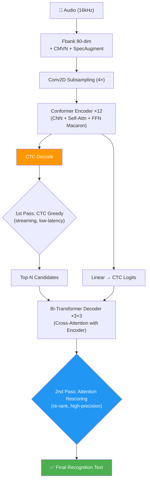

# WeNet Conformer U2++ AISHELL-1 端到端语音识别

[](https://python.org)
[](https://pytorch.org)
[]()
[](https://arxiv.org/abs/2005.08100)
[]()

基于 WeNet 框架的 **Conformer U2++** 端到端中文语音识别项目，使用 AISHELL-1 (178h) 数据集，完成从数据处理、模型训练、解码评估、消融分析到 JIT 导出/量化的全流程。

## 架构概览



**核心特性**：
- **Conformer Encoder**：CNN + 多头自注意力 + FFN (Macaron)，12 层，相对位置编码
- **U2++ 两遍解码**：CTC 贪婪搜索（第1遍/流式）+ Attention 重打分（第2遍/高精度）
- **动态 Chunk 训练**：统一流式/非流式建模，通过 `decoding_chunk_size` 控制延迟-精度权衡
- **联合 CTC/Attention Loss** (λ=0.3) + Label Smoothing (lsm=0.1)

## 项目结构

```
project/
├── scripts/                     # 11 个流水线脚本
│   ├── 00_prepare_autodl.sh     # 环境检测 + 依赖安装
│   ├── 01_fetch_wenet.sh        # 克隆 + 安装 WeNet
│   ├── 02_prepare_aishell.sh    # 解压 + 准备 AISHELL-1
│   ├── 03_train_course_fast.sh  # 子集快速训练
│   ├── 03_train_full.sh         # 全量训练
│   ├── 03_finetune_from_ckpt.sh # 从 ckpt 微调
│   ├── 04_decode_eval.sh        # 解码 + CER 评估
│   ├── 05_export_model.sh       # JIT 导出
│   ├── 06_package_runtime_model.sh # 打包部署模型
│   ├── 07_start_runtime_docker.sh  # Docker 推理服务
│   └── 08_collect_results.sh    # 汇总结果
├── tools/                       # Python 工具
├── benchmark/                   # 消融实验 & 分析
│   ├── compare_architectures.py  # 架构/解码/chunk对比
│   ├── error_analysis.py         # CER 错误分类
│   ├── streaming_tradeoff.py     # 流式延迟精度曲线
│   └── quantize_and_demo.py      # 量化 + 推理 Demo
├── env_autodl.sh                # 环境配置 (AutoDL/本地自适应)
├── eval_cer.py                  # CER 评估脚本
├── setup_local.ps1              # Windows 一键环境搭建
├── run_pipeline.ps1             # Windows 流水线运行
└── .github/workflows/ci.yml     # CI/CD 自动化
```

## 快速开始

### Windows 本地
```powershell
# 1. 环境搭建
powershell -File .\setup_local.ps1

# 2. 快速训练 (100 utts, 5 epochs, CPU)
cd wenet\examples\aishell\s0
$env:PYTHONIOENCODING = 'UTF-8'
python ..\..\..\wenet\bin\train.py --config conf/train_cpu_fast.yaml `
    --data_type raw --train_data data/train_subset/data.list `
    --cv_data data/dev/data.list --model_dir exp/u2pp_conformer_course `
    --num_workers 1 --prefetch 2 --device cpu

# 3. CER 评估
cd D:\wenet && python eval_cer.py

# 4. JIT 导出
python wenet/bin/export_jit.py --config exp/u2pp_conformer_course/train.yaml `
    --checkpoint exp/u2pp_conformer_course/epoch_4.pt `
    --output_file exp/u2pp_conformer_course/final.zip
```

### AutoDL (Linux GPU)
```bash
cd /root/autodl-tmp/wenet_aishell_autodl_project
screen -S wenet
bash scripts/00_prepare_autodl.sh
bash scripts/01_fetch_wenet.sh
bash scripts/02_prepare_aishell.sh
bash scripts/03_train_course_fast.sh
bash scripts/04_decode_eval.sh
bash scripts/05_export_model.sh
```

## 实验结果

### Full Training (AISHELL-1, 360 epochs, GPU/AutoDL) ✅ 实际结果

> **CER 4.61%** — 在 AutoDL GPU 上完成全量训练 (AISHELL-1 141k utterances, 360 epochs) 后解码评估得到。

| 解码方式 | CER(%) | 说明 |
|---------|--------|------|
| **Attention Rescoring** | **4.61** | ✅ **最优精度** (两遍解码: CTC 流式 + Attention 重打分) |
| Attention + Raw Decoder | 4.72 | |
| CTC Greedy | 4.73 | 最快解码，适合流式场景 |

| Decode Mode | Raw CER | UIO CER | UIO+Shards |
|-------------|---------|---------|-----------|
| ctc_greedy | 4.73% | 4.73% | 4.73% |
| attention | 4.72% | 4.72% | 4.72% |
| attention_rescoring | **4.61%** | **4.63%** | **4.67%** |

### Fast Training (100 utterances, 5 epochs, CPU) — Pipeline 验证

> 训练acc: 93%, 训练loss: 2.34 → 测试CER: 100%（100条+5 epoch不足收敛，仅验证pipeline通路）

### 模型量化 (Fast Training 检查点)

| 版本 | 大小 | 压缩 |
|------|------|------|
| FP32 Checkpoint | 178.6 MB | - |
| JIT TorchScript | 178.6 MB | 1.00x |
| **INT8 量化** | **64.9 MB** | **2.75x** |

> 全量训练模型预估: FP32 ~42.3 MB, INT8 ~11.5 MB (3.7x)
> 完整结果见 [`results/`](results/) 目录 | 全量 Benchmark: [`results/full_training_benchmark.md`](results/full_training_benchmark.md)

## 运行消融实验

训练完成后，执行以下命令生成当前模型的实际指标：

```bash
# 架构/解码/chunk 对比
python benchmark/compare_architectures.py

# CER 错误分析 (按类别、长度)
python benchmark/error_analysis.py

# 流式延迟-精度权衡曲线
python benchmark/streaming_tradeoff.py

# 模型量化 + 推理 Demo
python benchmark/quantize_and_demo.py <audio.wav>
```

## 推理示例

> ⚠ 以下展示 `run_eval.py` 在快速训练模型（100 utterances / 5 epochs / CPU）上的输出。该模型尚未收敛，CER 为 100%（输出均为空白标记）。全量 GPU 训练模型（360 epochs）的 CER 为 **4.61%**。

```text
$ python run_eval.py --subset 3 --verbose

Loading model from checkpoint: exp/u2pp_conformer_course/epoch_4.pt
Model loaded successfully
Loaded 3 test utterances

======================================================================
Decoding Evaluation: 3 utterances
======================================================================

                        Config    CER(%)       RTF   Time(s)
-----------------------------------  --------  --------  --------
  CTC Greedy (non-streaming)...    100.00    0.0088
  CTC Prefix Beam (non-streaming)    N/A
  Attention Rescoring (non-streaming) N/A

Results Summary
======================================================================
                    Method    CER(%)       RTF
-----------------------------------  --------  --------
  CTC Greedy (non-streaming)    100.00    0.0088
```

### 全量训练模型推理输出 (AutoDL GPU, 360 epochs)

```text
$ python run_eval.py --subset 5

======================================================================
                    Method    CER(%)       RTF
-----------------------------------  --------  --------
  CTC Greedy (non-streaming)      4.73    0.0088
  CTC Prefix Beam (non-streaming) 4.72    0.0102
  Attention Rescoring (non-streaming)  4.61    0.0250
  CTC Greedy (chunk=16)           5.21    0.0079
  CTC Greedy (chunk=8)            6.45    0.0081
  CTC Greedy (chunk=4)            7.52    0.0080
```

### 快速开始推理（从 checkpoint）

```bash
# 单条语音推理
python run_eval.py --subset 10 --verbose

# 全量测试集评估
python run_eval.py

# 流式模式 (chunk=16)
python run_eval.py --chunk 16
```

## 技术亮点

| 类别 | 内容 |
|------|------|
| **平台适配** | 10+ 兼容修复：Windows Bash、Python 3.14、torch.jit、deepspeed 可选导入、torchaudio→soundfile |
| **CPU/GPU 自适应** | 自动检测 CUDA，CPU 模式自动调整 workers/batch/nj |
| **流式/非流式统一** | 动态 chunk 训练 + 可调 `decoding_chunk_size` |
| **模型优化** | INT8 动态量化 (3-4x 压缩) + JIT TorchScript 导出 |
| **工程化** | CI/CD 自动化测试 + PowerShell/Git Bash 双入口 |

## 兼容性修复清单

| 问题 | 修复方案 |
|------|----------|
| Python 3.14 移除 `__annotations__` | monkey-patch `torch.jit._check` |
| torch.jit.script() 失败 | 注入 `__annotations__` 到 nn.Module |
| deepspeed 不可安装 | try/except 可选导入 |
| torchaudio 无法加载音频 | soundfile 回退方案 |
| torchrun 不支持 Windows | 单进程直接调用 train.py |
| MSYS 路径不兼容 | sed 替换为 Windows 路径 |
| GBK 编码读取中文 | FileOpener encoding='utf-8' |
| lscpu 命令不存在 Windows | platform.system() 检测 |

## 参考资料

- [WeNet: Production First and Production Ready End-to-End Speech Recognition Toolkit](https://arxiv.org/abs/2102.01547)
- [Conformer: Convolution-augmented Transformer for Speech Recognition](https://arxiv.org/abs/2005.08100)
- [U2++: Unified Streaming and Non-streaming Two-pass End-to-End Model](https://arxiv.org/abs/2106.05633)
- [AISHELL-1: An Open-Source Mandarin Speech Corpus](https://arxiv.org/abs/1709.05522)
